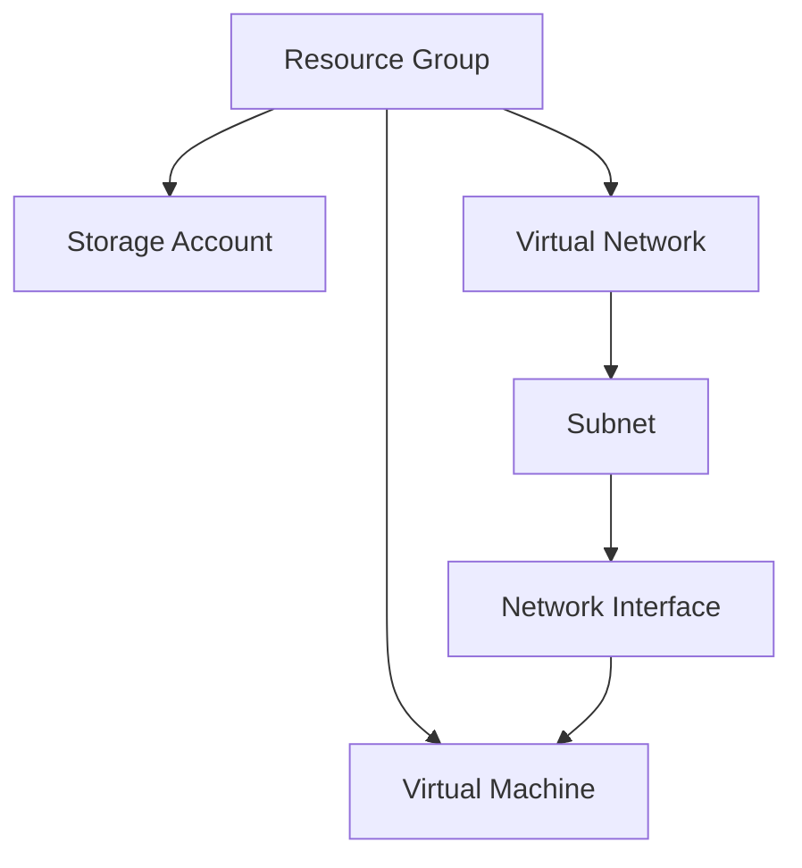
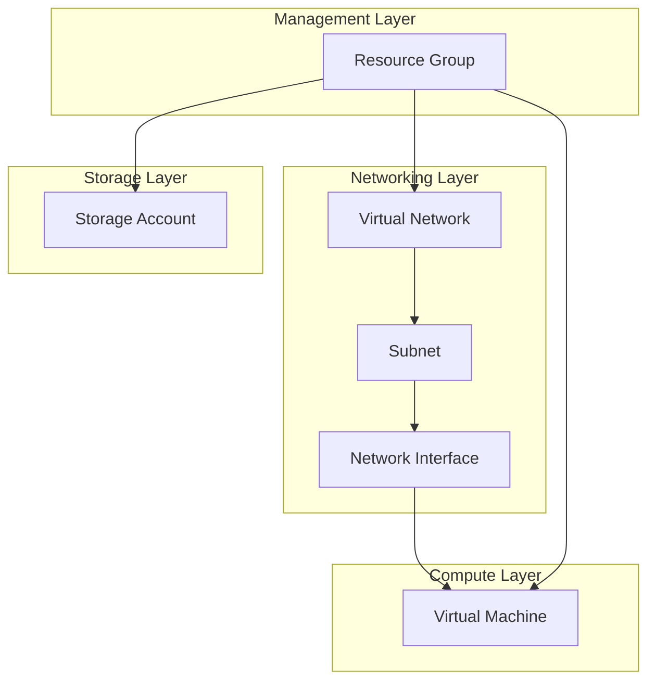

# Azure Infrastructure Component Structure

This document outlines the structure and relationships of the Azure components deployed through our Terraform configuration.

## Core Components

### Resource Organization

## Component Details

### 1. Resource Group
- **Purpose**: Contains all deployed resources
- **Name**: Defined by `var.resource_group_name`
- **Location**: Set by `var.location`
- **Tags**: 
  - Environment: dev/staging/prod
  - ManagedBy: Terraform

### 2. Storage Account
- **Purpose**: General purpose storage
- **Configuration**:
  - Tier: Standard
  - Replication: LRS (Locally Redundant Storage)
- **Naming**: Derived from resource group name
- **Dependencies**: Resource Group

### 3. Virtual Network (VNet)
- **Purpose**: Network isolation and communication
- **Configuration**:
  - Address Space: 10.0.0.0/16
  - Location: Same as Resource Group
- **Dependencies**: Resource Group

### 4. Subnet
- **Purpose**: Network segmentation
- **Configuration**:
  - Name: "internal"
  - Address Range: 10.0.1.0/24
- **Dependencies**: Virtual Network

### 5. Network Interface (NIC)
- **Purpose**: VM network connectivity
- **Configuration**:
  - Dynamic IP allocation
  - Connected to internal subnet
- **Dependencies**: 
  - Subnet
  - Resource Group

### 6. Virtual Machine
- **Purpose**: Compute resources
- **Configuration**:
  - Size: Standard_B1s
  - OS: Ubuntu 22.04 LTS
  - Authentication: Username/Password
- **Dependencies**:
  - Network Interface
  - Resource Group

## Resource Dependencies

## Security Components

### Network Security
- Subnet isolation
- Network interface configuration
- Dynamic IP allocation

### Authentication
- VM authentication using username/password
- Service Principal for deployment
- Azure Storage authentication

### Resource Access
- Resource Group level access control
- Storage Account access restrictions
- VM access management

## Tags and Naming Convention

### Resource Tags
All resources include the following tags:
- `Environment`: Indicates deployment environment
- `ManagedBy`: Set to "Terraform" for automation tracking

### Naming Convention
- Resource Group: User-defined (var.resource_group_name)
- Storage Account: Derived from RG name (lowercase, no special characters)
- Virtual Network: "main-vnet"
- Subnet: "internal"
- Network Interface: "{resource_group_name}-nic"
- Virtual Machine: "{resource_group_name}-vm"

## Terraform State Management

### Backend Configuration
- State stored in Azure Storage Account
- Uses separate storage container
- Enables state locking
- Supports team collaboration

### State Dependencies
- All resources tracked in state file
- Dependencies automatically managed
- State changes trigger appropriate updates

## Deployment Considerations

### Order of Operations
1. Resource Group creation
2. Storage Account deployment
3. Network infrastructure setup
4. VM deployment

### Modification Impact
- Changes to networking may affect VM connectivity
- Storage account modifications may require downtime
- Resource group changes affect all contained resources

## Monitoring and Management

### Available Metrics
- VM performance metrics
- Network throughput
- Storage account metrics

### Management Options
- Azure Portal access
- Terraform state management
- Infrastructure automation through GitHub Actions

## Best Practices

1. **Resource Organization**
   - Group related resources
   - Use consistent tagging
   - Implement proper naming conventions

2. **Security**
   - Follow least privilege principle
   - Implement network isolation
   - Use secure authentication methods

3. **Scalability**
   - Design for growth
   - Use appropriate VM sizes
   - Plan network addressing

4. **Maintenance**
   - Regular updates
   - Backup strategies
   - Monitoring implementation
