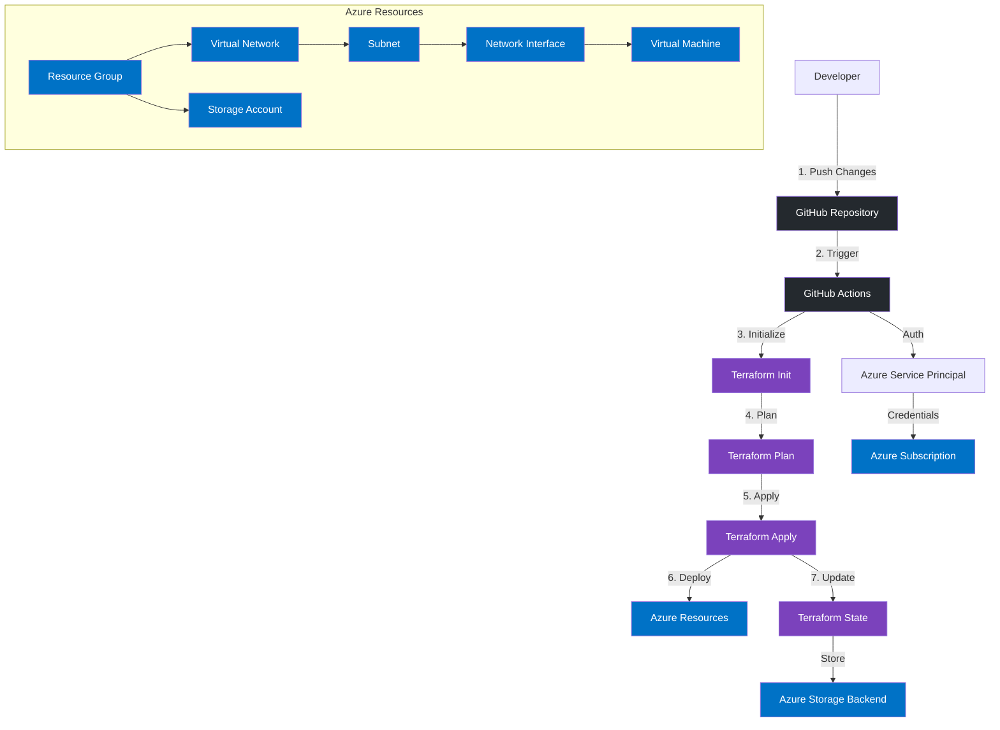

# Infrastructure Deployment Workflow

## Workflow Description

1. **Developer Initiates Changes**
   - Push code changes to GitHub repository
   - Changes can include Terraform configurations, variables, or outputs

2. **GitHub Actions Triggered**
   - Workflow automatically starts on push or pull request
   - Authenticates with Azure using Service Principal

3. **Terraform Initialize**
   - Sets up Terraform working directory
   - Downloads required providers
   - Configures backend storage

4. **Terraform Plan**
   - Creates an execution plan
   - Shows resource changes to be made
   - Validates configuration

5. **Terraform Apply**
   - Executes the planned changes
   - Creates/updates Azure resources
   - Updates state file

6. **Azure Resource Deployment**
   - Creates/updates Resource Group
   - Deploys Virtual Network infrastructure
   - Sets up Virtual Machine
   - Configures Storage Account

7. **State Management**
   - Updates Terraform state
   - Stores state in Azure Storage
   - Enables team collaboration

## Security Considerations

- Service Principal with minimal required permissions
- Secrets stored in GitHub Secrets
- State file stored in secure Azure Storage
- Network security rules for resources
